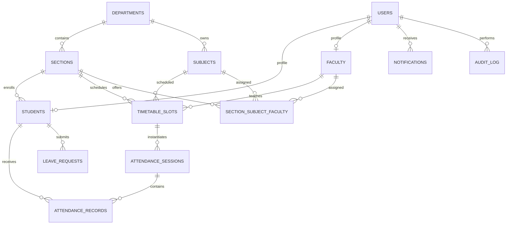

# SmartAttend — System Design

## 1. Purpose and scope

SmartAttend is a single-institution attendance system for administrators, faculty, and students. This document describes the product rules, how the modules work together, and how the design maps to the current React/Vite and Spring Boot project.

The system of record is the relational database. Dashboards, reports, alerts, and attendance percentages must be derived from persisted records through the backend; a UI value or successful QR scan is not proof of attendance unless the backend validates and stores it.

### Delivery status

The repository already contains a React/Vite frontend and a Spring Boot backend. It has JWT authentication, role-aware dashboard endpoints, an H2 local profile, MySQL migrations, a QR attendance-session flow, leave-related schema, and notification-related schema. The QR flow uses a signed token valid for 20 seconds. Face and fingerprint providers are integration boundaries and are not usable until configured. A database table or endpoint does not by itself mean its full user workflow is complete. Treat the features below as requirements unless the implementation is explicitly identified as present in the code and README.

## 2. Roles and access

| Capability | Admin | Faculty | Student |
|---|---|---|---|
| Sign in and view own dashboard | Yes | Yes | Yes |
| Manage student and faculty accounts | Yes | No | No |
| Manage departments, sections, subjects, timetable, and assignments | Yes | Read assigned scope | Read own scope |
| Start/stop attendance sessions | No | Assigned timetable slots only | No |
| Generate session QR | No | Own open sessions only | No |
| Record attendance by QR | No | No (faculty starts the session) | Own enrollment and valid open session only |
| Edit or correct attendance | Authorized admin workflow | Authorized class workflow | Submit a correction request |
| View attendance and reports | Institution scope | Assigned classes | Own records only |
| Submit leave request | No | No | Yes |
| Review leave request | Institution policy | Assigned students, if enabled | No |
| Publish institution announcements | Yes | Optional, if enabled | No |

Authorization must be enforced by the backend for every protected operation. Frontend route guards improve navigation but are not a security boundary. A role check alone is not sufficient: enforce record ownership and assignment scope as well. Public registration must not let a caller self-assign the ADMIN role.

## 3. Academic structure and source of truth

The academic hierarchy is:

```text
Department
└── Section (cohort/year/group, for example: Year 1 / MPC-A)
    ├── Students
    ├── Timetable slots
    └── Subject assignments
        ├── Subject
        └── Assigned faculty member
```

In this project, `sections` represent the teaching group. Do not model “class” and “section” as competing names for the same entity. A student belongs to one active section at a time; a section offers subjects, and each section-subject assignment has an assigned faculty member. Timetable slots connect a section, subject, faculty member, weekday, time, and room. Session creation must use a matching timetable slot and verify that the authenticated faculty member owns that assignment.

## 4. End-to-end attendance workflow

```mermaid
sequenceDiagram
    actor Admin
    actor Faculty
    actor Student
    participant UI as React client
    participant API as Spring Boot API
    participant DB as Relational database

    Admin->>UI: Configure department, section, subject, enrollment, assignments, timetable
    UI->>API: Authenticated create/update requests
    API->>DB: Validate relationships and persist configuration
    Faculty->>UI: Start session for assigned timetable slot
    UI->>API: POST /api/sessions/start
    API->>DB: Verify faculty, slot, subject, section; create OPEN session
    Faculty->>UI: Request rotating QR token
    UI->>API: GET /api/sessions/{id}/qr
    API-->>UI: Signed token and expiry (20 seconds)
    Student->>UI: Scan QR
    UI->>API: POST /api/attendance/mark
    API->>DB: Validate token, open session, enrollment, uniqueness; save record
    API-->>UI: Accepted or clear validation error
    Faculty->>UI: Stop session
    UI->>API: POST /api/sessions/{id}/stop
    API->>DB: Close session
    API-->>UI: Updated attendance summaries for dashboards and reports
```

### Session and record rules

1. Only an authenticated faculty member assigned to the timetable slot can start or stop its session or retrieve its QR token.
2. A session has an explicit state (`OPEN` or `CLOSED`). Only an open session accepts attendance. Repeated open sessions for the same slot must be rejected.
3. A QR token is signed, bound to its session, short-lived (currently 20 seconds), and validated by the backend. The QR image/token is a credential, not a student identity; the authenticated student account identifies who is submitting the scan.
4. The student must be active and enrolled in the session's section. The backend rejects invalid/expired tokens, closed sessions, out-of-section students, and duplicate submissions.
5. Enforce a database uniqueness constraint on `(session_id, student_id)` in addition to application validation. Client UUID idempotency is useful for retries but does not replace this constraint.
6. Closing a session finalizes the set of expected students. A missing record for an enrolled student in a closed session counts as absent for reporting, or the system writes an explicit `ABSENT` record during finalization. Choose one canonical representation and use it consistently; never count a missing row as present.
7. Every manual correction records the previous/new status, actor, timestamp, and reason in an audit trail. Students submit a correction request; they cannot edit their own attendance.

## 5. Attendance calculation and alerts

For a student and subject, let `P` be the number of attended sessions and `C` the number of conducted sessions in which the student was enrolled:

```text
attendance percentage = C == 0 ? 0 : round(P * 100 / C, 2)
```

Use the same definition, enrollment snapshot, timezone, and rounding rule in student summaries, faculty class views, admin analytics, notifications, and exports. A session counts as conducted only after it is closed. Do not include future or open sessions in the denominator. Define `P` from an explicit attendance status (for example, `PRESENT`); do not infer presence from the existence of any record if records can also be `ABSENT` or `EXCUSED`.

Institution policy must decide whether approved excused sessions are excluded from `C` or retained as non-present sessions. Store that policy centrally and apply it uniformly; do not silently change historic percentages when a request is approved. Avoid treating an approved multi-day leave as attendance: leave approval records an excused reason, while attendance remains tied to individual conducted sessions.

Thresholds are configuration, not hard-coded presentation rules. The current schema seeds required 75%, warning 74%, and critical 65%; define boundary behavior explicitly (for example, `< required` is below requirement, and critical/warning bands must not overlap). Alerts should be recalculated after a session is finalized or a correction changes a record. Avoid sending duplicate alerts for the same student, threshold, and academic period.

For a target requirement `R` (as a fraction), with `P` attended and `C` conducted, the minimum consecutive future sessions needed to reach the target is:

```text
needed = max(0, ceil((R * C - P) / (1 - R)))
```

If `R >= 1`, report that the target cannot be reached through future attendance alone unless already met. Label this as a projection, not a guarantee.

## 6. Leave, correction, and notification workflow

```text
Student submits request
  → validate dates and student identity
  → route to assigned faculty reviewer (and admin if policy requires it)
  → record decision, reviewer, timestamp, and note
  → notify student and relevant reviewers
  → if approved, apply the configured excused-attendance policy to affected sessions
```

Requests have `PENDING`, `APPROVED`, `REJECTED`, or `CANCELLED` status. A leave request is not itself an attendance record. Approval must not overwrite an unrelated recorded status without an auditable correction. Longer-leave admin approval is configurable. Students see their own requests; faculty see only requests in their assigned scope; admins see institution records.

Notifications can target a user or a role audience. The API must enforce who can create an institution-wide announcement, and each recipient can only view/update their own read state. Attendance alerts and announcements use the same notification delivery/read model, with distinct types.

## 7. Main modules and responsibilities

| Module | Responsibility |
|---|---|
| Authentication and security | Login, password hashing, JWT validation, active-account checks, role and ownership authorization |
| Academic administration | Departments, sections, students, faculty, subjects, enrollment, assignments, timetable, settings |
| Attendance | Session lifecycle, QR issue/validation, attendance records, corrections, percentages |
| Leave | Request submission, review routing, decisions, excused-session policy |
| Dashboard and reporting | Role-scoped summaries, trends, exports, and consistent calculations |
| Notifications | Alerts, announcements, recipient scope, read state |
| Audit | Record security-sensitive configuration and attendance changes |

Keep these as modules inside the existing Spring Boot application. Controllers handle HTTP validation/response mapping; services own business rules and transactions; repositories perform persistence. Services call other services in-process. The React app communicates with the API over HTTP/JSON using the existing frontend API client. No API gateway, service discovery, or inter-service HTTP calls are required for this single deployable application.

## 8. Data model

The existing schema and migrations are canonical. Core relationships:



Important constraints include unique user email, unique student roll number within a section, one active section-subject faculty assignment, unique `(session_id, student_id)` attendance, valid status/date ranges, and foreign keys for all ownership relationships. Use migrations as the source of schema changes; do not rely on production auto-DDL.

## 9. Architecture and security

```text
React/Vite browser client
       │ HTTPS + JSON, Authorization: Bearer <JWT>
       ▼
Spring Boot application (one deployment)
  ├── REST controllers
  ├── authentication and authorization filters
  ├── feature services and transaction boundaries
  └── Spring Data repositories
       │
       ▼
Relational database (H2 for local development; MySQL profile for deployment)
```

Passwords are stored as BCrypt hashes. JWTs are stateless and authenticated requests must derive the actor from the verified token, not trust a client-supplied user ID. Enforce role checks and object-level scope in the backend. Validate inputs, use parameterized repository operations, return useful `401`, `403`, `404`, `409`, and validation responses, and avoid leaking sensitive student data in logs or reports. Production deployment must use HTTPS, a strong externally configured JWT secret, restricted CORS origins, and an appropriate token storage strategy.

QR attendance is the supported smart check-in path in the current implementation. Geolocation is optional and must be explicitly enabled by institutional policy; if used, validate coordinates and campus radius on the server, collect only what is needed, and provide a manual accommodation path. Face recognition and fingerprint attendance remain disabled until their providers, consent/policy, security, and fallback flows are in place. Never describe these as implemented merely because method names or schema values exist.

## 10. API integration contract

Existing implemented API slices documented by the project README include:

| Endpoint | Purpose | Access rule |
|---|---|---|
| `POST /api/auth/login` | Authenticate and issue JWT | Public |
| `GET /api/auth/me` | Restore current session identity | Authenticated |
| `POST /api/sessions/start` | Start a session for an assigned timetable slot | Assigned faculty |
| `POST /api/sessions/{id}/stop` | Close an owned open session | Session owner |
| `GET /api/sessions/{id}/qr` | Issue short-lived QR token | Session owner |
| `POST /api/attendance/mark` | Validate QR and record own attendance | Enrolled student |
| `GET /api/dashboard/student` | Student attendance summary | Own student profile |
| `GET /api/dashboard/faculty` | Faculty's assigned classes and sessions | Own faculty profile |
| `GET /api/dashboard/faculty/class` | Attendance for an owned timetable slot | Assigned faculty |
| `GET /api/dashboard/admin` | Institution dashboard and analytics | Admin role |

Other screens must use authenticated backend endpoints and the existing API client; do not fill gaps with demo constants. When adding an endpoint, document its request/response, role and ownership rules, pagination/filtering where relevant, and refresh behavior after mutations. The client should render loading, error, empty, and success states. After a mutation, refetch or update affected server-backed data so dashboards do not remain stale.

## 11. Delivery order and acceptance criteria

1. **Academic setup:** create departments, sections, subjects, users, enrollment, faculty assignments, timetable, and policy settings with validation and audit history.
2. **Authentication and scoping:** verify role and record ownership on both API and UI; block self-escalation during registration.
3. **Attendance sessions:** start/stop only for valid assigned slots; issue and validate signed short-lived QR tokens; reject invalid enrollment and duplicates at application and database layers.
4. **Attendance visibility:** derive student, faculty, and admin dashboards from the same persisted closed-session dataset and calculation rule.
5. **Leave and corrections:** route reviews by scope/policy, keep decisions auditable, and apply the excused policy without silently fabricating attendance.
6. **Alerts and reports:** calculate low-attendance state from canonical settings and data; avoid duplicate notifications; restrict exports to authorized scope.
7. **Frontend integration:** remove mock values from data-bearing cards, tables, and charts; add loading/error/empty states; refresh affected views after actions.

The integrated flow is acceptable when an authorized admin configures a section and timetable, assigned faculty opens a session, an enrolled student submits a valid QR scan, the database stores one attributable record, a repeated/expired/out-of-scope scan is rejected, session closure updates all role-scoped views consistently, and leave/correction actions preserve the audit trail. Validate calculations against database rows and test authorization boundaries as well as happy paths.

## 12. Related project references

- [ER diagram and schema notes](ER-diagram.md)
- [Project setup and implemented API slice](../README.md)
- Database migrations: `backend/src/main/resources/db/migration/`
